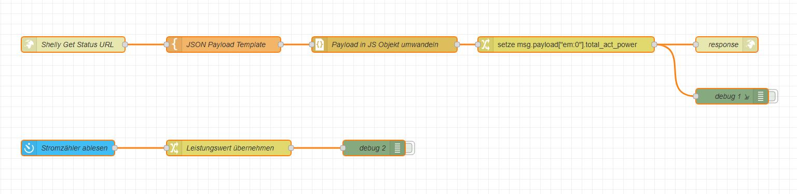

# maxxicharge-shelly-simulation
Simulation der von der Maxxicharge CCU verwendeten Shelly Pro 3EM Datenschnittstelle 

# Motivation
Das Maxxicharge System benötigt für eine sinnvolle Nutzung den aktuelle Stromverbrauch 
aus des jeweils verbauten Zählers. Um diesen Verbrauch zu ermitteln bietet Maxxisun
derzeit drei verschiedene Optionen an.

- PowerOpti
- Shelly 3EM
- Shelly 3EM Pro

Der PowerOpti wird direkt auf der optischen Schnittstelle des Zählers montiert und
übernimmt so die "echten" vom Zähler gemessenen Verbrauchswerte. Die Shellies müssen vom Elektriker im Hausauschlussschrank
installiert werden und liefern ihre eigenen Messwerte.

Beide Systeme haben Vor- und Nachteile, die hier nicht im Detail diskutiert werden.

# Fragestellung
Kann man einen "beliebigen" Tasmota basierten optischen Zählersensor verwenden, um die 
notwendigen Zählerwerte (ohne PowerOpti oder Shelly) für eine Maxxicharge CCU bereitzustellen.

# Lösung - JA - es funktioniert
Es müssen allerdings ein paar Voraussetzungen erfüllt sein, damit man der Maxxicharge CCU
einen Tasmota basierten Lesekopf für Stromzähler als "Shelly 3EM Pro" unterjubeln kann.

Notwendig ist:
1. Einen Lesekopf für den Stromzähler, der auf der Tasmota OpenSource Firmware beruht und
   für den es ein passendes Script zum Auslesen der Zählerdaten gibt.
   Die aktuellen Scripte finden sich hier: https://tasmota.github.io/docs/Smart-Meter-Interface/
2. Man benötigt ein geeignetes System (z.B. Smart Home System), das zu einen die Daten
   des Lesekopfes auslesen kann, zum anderen für den Maxxicharge einen "kleine" Webserver
   mit einem dem Shelly (auf einfachsten Pro 3EM) angepassten API mit den ausgelesenen Daten
   zur Verfügung stellt.
3. Das ganze muss noch bei http://maxxi.app konfiguriert werden und natürlich 7x24 durchlaufen.

# Lösungsdetails
Die nachfolgend beschriebene Lösung ist ein Ansatz, der m.E. nach technisch nicht superkompliziert
ist, da er auf bewährten Komponenten und Integrationen im Bereich OpenSource zurückgreift, ohne
dass selbst ge-scriptet oder sogar programmiert werden muss.

## Technische Komponenten (in meinem Beispiel)
- Tasmota kompatibler Lesekopf für Stromzähler mit integriertem WiFi
  **Wichtig:** Vorher prüfen, ob der Lesekopf für den eigenen Zähler passt und ob ein entsprechenden Script
  zum Auslesen der Zählerwerte vorhanden ist - sonst wirds m.E. extrem schwierig.
- HomeAssistant (Aktuelle Softwareversion)
  **Hardware:** Keine Empfehlung von mir. Ich nutze selbst ein fertiges System von NabuCasa, da ich kein
  Hardwarebastler bin.

## Homeassistant Konfiguration

### Zählerdaten vom Lesekopf in HA integrieren


### Zählerwert (Leistung) im Shelly API Format bereitstellen

Die eigentliche Funktionaliät habe ich auf Homeassistant über das "Node-RED" add-on realisiert. Vielleicht
geht es auch anders - dann bitte entsprechende Infos per PR oder GitHub Issue ergänzen.

Schritte dazu:
1. "Node-RED" add-on bei den offizielle HA Add-ons in den Einstellungen laden
   Hinweis: Ich musste in der Konfiguration des Add-ons noch "SSL" ausschalten - ansonsten habe ich
   die Standardeinstellungen so gelassen.
2. "Node-RED" Starten,.... - zur Oberfläche wechseln
3. Den Beispielflow (unten) importieren

```
[{"id":"1d0d7f5a29f74393","type":"tab","label":"Simulate Shelly 3EM Pro - Power","disabled":false,"info":"","env":[]},{"id":"595e47ef9d7445d9","type":"http in","z":"1d0d7f5a29f74393","name":"Shelly Get Status URL","url":"/rpc/Shelly.GetStatus","method":"get","upload":false,"swaggerDoc":"","x":180,"y":100,"wires":[["9d6ab5b1a9d67936"]]},{"id":"5e824c09df4b32ce","type":"http response","z":"1d0d7f5a29f74393","name":"response","statusCode":"","headers":{},"x":1440,"y":100,"wires":[]},{"id":"9d6ab5b1a9d67936","type":"template","z":"1d0d7f5a29f74393","name":"JSON Payload Template","field":"payload","fieldType":"msg","format":"json","syntax":"mustache","template":"{\n     \"em:0\": {\n        \"total_act_power\": 100\n    }\n}","output":"json","x":470,"y":100,"wires":[["dc090c718f915bbb"]]},{"id":"646d5004d980f536","type":"debug","z":"1d0d7f5a29f74393","name":"debug 1","active":false,"tosidebar":true,"console":true,"tostatus":true,"complete":"payload","targetType":"msg","statusVal":"payload","statusType":"auto","x":1450,"y":200,"wires":[]},{"id":"be5c7e35714cf1fd","type":"change","z":"1d0d7f5a29f74393","name":"Leistungswert übernehmen","rules":[{"t":"set","p":"power","pt":"flow","to":"payload","tot":"msg"}],"action":"","property":"","from":"","to":"","reg":false,"x":480,"y":300,"wires":[["1c867c9b21f87b25"]]},{"id":"b265dd264a02820f","type":"poll-state","z":"1d0d7f5a29f74393","name":"Stromzähler ablesen","server":"eeb0c6a6.8128e8","version":3,"exposeAsEntityConfig":"","updateInterval":"1","updateIntervalType":"num","updateIntervalUnits":"seconds","outputInitially":false,"outputOnChanged":false,"entityId":"sensor.stromdd3_sm_16_7_0","stateType":"num","ifState":"","ifStateType":"str","ifStateOperator":"is","outputs":1,"outputProperties":[{"property":"payload","propertyType":"msg","value":"","valueType":"entityState"},{"property":"data","propertyType":"msg","value":"","valueType":"entity"},{"property":"topic","propertyType":"msg","value":"","valueType":"triggerId"}],"x":170,"y":300,"wires":[["be5c7e35714cf1fd"]]},{"id":"1c867c9b21f87b25","type":"debug","z":"1d0d7f5a29f74393","name":"debug 2","active":false,"tosidebar":true,"console":false,"tostatus":false,"complete":"false","statusVal":"","statusType":"auto","x":760,"y":300,"wires":[]},{"id":"dc090c718f915bbb","type":"json","z":"1d0d7f5a29f74393","name":"Payload in JS Objekt umwandeln","property":"payload","action":"obj","pretty":false,"x":780,"y":100,"wires":[["176b4b0c29b8ce48"]]},{"id":"176b4b0c29b8ce48","type":"change","z":"1d0d7f5a29f74393","name":"","rules":[{"t":"set","p":"payload[\"em:0\"].total_act_power","pt":"msg","to":"power","tot":"flow"}],"action":"","property":"","from":"","to":"","reg":false,"x":1130,"y":100,"wires":[["646d5004d980f536","5e824c09df4b32ce"]]},{"id":"eeb0c6a6.8128e8","type":"server","name":"Home Assistant","addon":true,"rejectUnauthorizedCerts":true,"ha_boolean":"","connectionDelay":false,"cacheJson":false,"heartbeat":false,"heartbeatInterval":"","statusSeparator":"","enableGlobalContextStore":false}]
```
4. Den Beispielflow anpassen



**Vorab:** Das ist mein erster (richtiger) Flow in Node-RED - ich bitte alle Profis um Nachsicht und nehme gerne Verbesserungen per Issue oder PR an.

Der "obere" Flow stellt das REST-API mit dem Shelly Pro 3EM Endpunkt "http://<Shelly-IP>/rpc/Shelly.GetStatus bereit. Die CCU benötigt von dem umfangreichen JSON, dass der Shelly liefert, nur exact einen Wert, nämlich (wenig überraschend) den aktuellen Gesamtverbrauch:
```
{
     "em:0": {
        "total_act_power": 100
    }
}
```
Der von der CCU Firmware verwendete JSON-Parser braucht das Feld an der "richtigen" Stelle der Struktur, alles andere wird (wie bei JSON erwartet) ignoriert.

Am "oberen" Flow muss nichts angepasst werden. 

Der "untere" Flow stellt den aktuellen Verbrauchswert als Zahl aus der entsprechenden HA Entität bereit. Bei meinem Zähler ist das "sensor.stromdd3_sm_16_7_0" - doppel-click auf den ersten Node erlaubt die Änderung des Sensors, ebenso wie die Frequenz in der die Daten vom Sensor geholt werden. 

**Wichtig:** Hier muss natürlich der richtige Sensor stehen.

Die beiden "debug" nodes sind standardmässig deaktiviert, helfen aber bei der Problemsuche wenn was nicht klappt. Bei "unteren" Flow sieht man im Debug, ob überhaupt Zählerwerte gefunden und angeliefert werden. Beim "oberen" Flow muss das API per "GET" unter des ensprechenden URL aufgerufen werden und liefert dann das JSON zurück.
Die URL ist beim Standardnamen der HA Instanz "http://homeassistant.local:1880/endpoint/rpc/Shelly.GetStatus" und funktioniert auch im Browser.

### Konfiguration für den Maxxicharge anpassen


